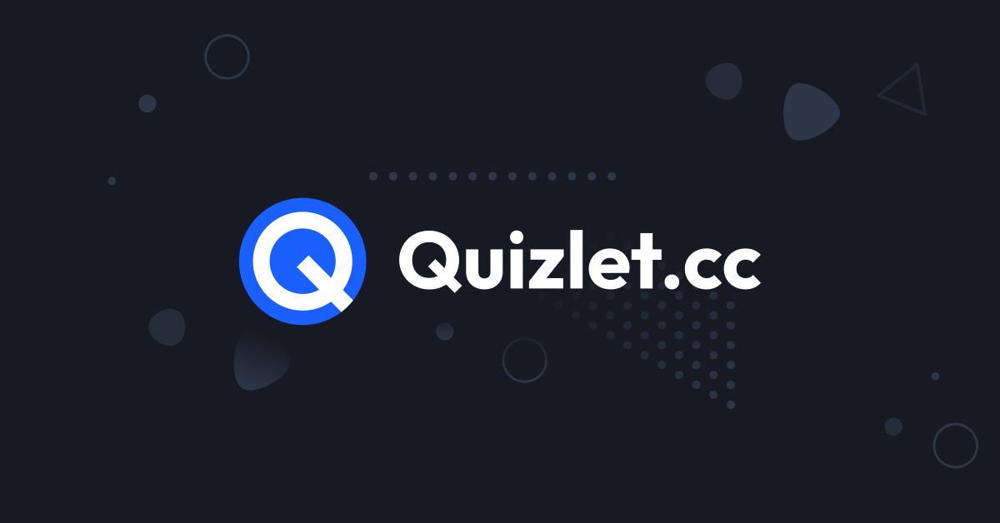

[](https://quizlet.cc)

> Tired of Quizlet showing ads and only giving you a few practice rounds for free? Stop wasting your time getting bombarded by premium offers, and resume studying today.

## The Stack

- [Create T3 App](https://create.t3.gg)
- [Next.js](https://nextjs.org)
- [tRPC](https://trpc.io)
- [NextAuth.js](https://next-auth.js.org)
- [Prisma](https://prisma.io)
- [Chakra UI](https://chakra-ui.com)
- [TypeScript](https://www.typescriptlang.org)
- [PostgreSQL](https://www.postgresql.org)
- [Zustand](https://github.com/pmndrs/zustand)

## Running Locally

Get up and running by following these steps.

### Prerequisites

- Node.js 18.x
- PostgreSQL
- Yarn
- Docker and docker-compose _(recommended)_

### Setup

1. Clone the repo

   ```sh
   git clone https://github.com/miapolis/quizlet.cc
   ```

2. Go to the project folder

   ```sh
   cd quizlet.cc
   ```

3. Install dependencies with yarn

   ```sh
   yarn
   ```

4. Set up the `.env` file

   - Copy `.env.example` to `.env`
   - Use `openssl rand -base64 32` to generate a key for `NEXTAUTH_SECRET` and set it as the value in `.env`
   - You'll need to create a Google OAuth client ID from the [Google API Console](https://console.developers.google.com/). There are plenty of guides for this, like [this one from LogRocket](https://blog.logrocket.com/nextauth-js-for-next-js-client-side-authentication/#create-a-google-oauth-app) embedded:

     > 
     >
     > Navigate to Credentials and click on Create credentials, and then OAuth client ID. You will be asked to fill in the following:
     >
     > **Choose an Application Type**: Select Web Application
     >
     > **Name**: This is the name of your application
     >
     > **Authorized JavaScript origins**: This is the full URL to the homepage of our app. Since we are still in development mode, we are going to fill in the full URL our development server is running on. In this case, it is `http://localhost:3000`
     >
     > **Authorized redirect URIs**: Users will be redirected to this path after they have authenticated with Google: `http://localhost:3000/api/auth/callback/google`

     Copy your client ID and secret created and fill in the `GOOGLE_CLIENT_ID` and `GOOGLE_CLIENT_SECRET` values in `.env`

     

   - Create an account on [ScraperAPI](https://www.scraperapi.com) and copy the API key to `SCRAPER_API_KEY`
   - Lastly, set `ADMIN_EMAIL` equal to the email address of the Google account you wish to have admin privileges

5. Start up a local postgres instance with

   ```sh
   docker-compose -f docker-compose.postgres.yml up
   ```

6. Set up the database

   ```sh
   yarn db-setup
   ```

### Running

Start a development server with

```sh
yarn dev
```

or create and start a production build with

```
yarn build
yarn start
```

Navigate to http://localhost:3000 and Quizlet.cc should be up and running!
